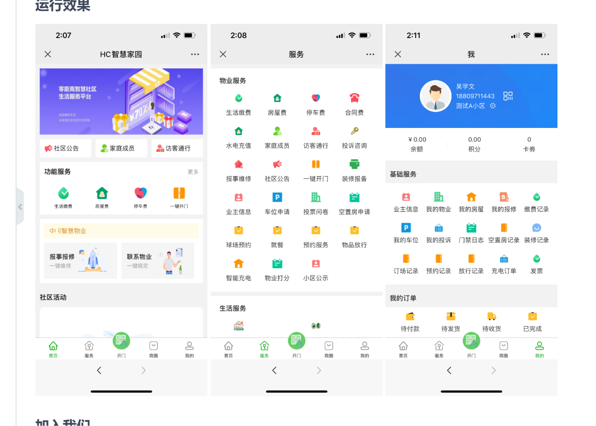

# 创建前端项目文件初始项目并且提交到git

# 下方图片为页面原型图



# 下方为所需要的功能描述（大概，可后续添加需要的功能，开发需要按照模块化的方式进行，以便后续可添加其它模块功能）

```aiignore
## 甲方功能
    ——登录
    | |——管理员端
    | | |——普通管理
    | | | |——维修人员查询
    | | | |——维修人员派遣
    | | | |——工作汇报查询
    | | | |——工作汇报审核
    | | | |——维修人员信息录入
    | | | |——资源导入
    | | |——超级管理
    | | | |——维修申报审批
    | | | |——维修人员管理
    | | | |——维修人员统计
    | | | |——工作汇报查询
    | | | |——工作汇报历史记录 
    | | | |——系统设置（干掉小程序哪来的系统设置啊）（转网站，可以设置系统的设置）
    | | | |——资源导入 （暂时不知道导入的啥） （比如word文档）
    | | |——用户端
    | | | |——教师端
    | | | | |——维修申报
    | | | | |——维修进度查询
    | | | | |——维修人员查询
    | | | |——工作人员端
    | | | | |——被派遣查询+后台提醒 
    | | | | |——工作汇报+工作汇报修改 （不知道上传的类型，比如是word文档还是什么什么的）
    | | | | |——资源查询 （什么资源查询 ？？？），
## 归类为模块
1. 用户维修申报、管理员派遣工作人员进行维修、超级管理员审批通过派遣的人员
2. 工作人员进行工作汇报
```

# 下面DashinHolding文件夹nui-app项目的文件目录及使用方法

```aiignore
## 这个为项目文件目录
┌─uniCloud              # 云空间目录，阿里云为uniCloud-aliyun,腾讯云为uniCloud-tcb（详见uniCloud）
│─components            # 符合vue组件规范的uni-app组件目录
│  └─comp-a.vue         # 可复用的a组件
├─hybrid                # App端存放本地html文件的目录，详见
├─platforms             # 存放各平台专用页面的目录，详见
├─pages                 # 业务页面文件存放的目录
│  ├─index
│  │  └─index.vue       # index页面
│  └─list
│     └─list.vue        # list页面
├─static                # 存放应用引用的本地静态资源（如图片、视频等）的目录，注意： 静态资源只能存放于此
├─uni_modules           # 存放[uni_module](/uni_modules)。
├─wxcomponents          # 存放小程序组件的目录，详见
├─nativeplugins         # App原生插件 详见
├─unpackage             # 非工程代码，一般存放运行或发行的编译结果
├─main.js               # Vue初始化入口文件
├─App.vue               # 应用配置，用来配置App全局样式以及监听 应用生命周期
├─manifest.json         # 配置应用名称、appid、logo、版本等打包信息，详见
├─pages.json            # 配置页面路由、导航条、选项卡等页面类信息，详见
└─uni.scss              # 这里是uni-app内置的常用样式变量 
```                                                              

```aiignore
## 文件目录使用介绍
- pages					# 页面存放目录
- static				# 静态资源目录（如图片、视频等，静态文件只能存放到这里）
- App.vue				# 应用入口文件（跟小程序 app.js 类似，如：APP全局样式、监听声明周期）
- main.js				# 应用入口文件（如：Vue 初始化、定义全局组件 ...）
- manifest.json			# 项目配置文件（如：应用名称、appid、logo、版本、启动页 ...)
- pages.json			# 页面配置文件（如：页面路由、导航条、选项卡 ...）
- uni.scss				# 全局样式（如：按钮颜色、样式风格 ...）
- unpackage				# 编译后的文件存放目录
## 注意：下面需要自建的，根据项目开发情况创建即可。
- api					# 请求封装存放目录（自建）
- common				# 公共文件存放（自建）
- components			# 自定义组件存放（自建）- uniapp
- wxcomponents			# 小程序组件存放（自建）- wx
- store					# vuex 状态管理（自建）
- utils   				# 公共工具目录（自建）
- hybrid				# 存放本地网页目录（自建）
- platforms				# 存放各平台专用页面目录（自建）
- vue.config.js			# vue 配置管理（自建）
- vite.config.js        # vite 配置管理（自建）
```

# 下面WebDashinHolding文件夹web端vue3项目的文件目录及使用方法

```aiignore
## 文件目录及使用方法
├── node_modules/        # 项目依赖的 node 模块
├── public/              # 公共资源目录
│   ├── favicon.ico      # 网页图标
│   └── index.html       # html模板（单页面应用）
├── src/                 # 源代码目录
│   ├── assets/          # 静态资源文件夹，如图片、字体等
│   ├── components/      # 公共组件
│   ├── router/          # 路由文件夹
│   ├── store/           # Vuex状态管理文件夹
│   ├── views/           # 视图层组件
│   ├── App.vue          # Vue 根组件，也是整个应用的入口
│   └── main.js          # Vue 实例化入口文件，也是整个应用的入口
├── package.json         # 项目配置文件
├── README.md            # 项目说明文件
└── vite.config.js       # vite配置文件
```

# 移动端和web端项目启动顺序如下（详情可查看vue3和uni-app的官方文档）

```aiignore 
##uni-app的vue3语法版本按照顺序执行：创建项目、初始化、运行、发布（如是查看项目源码，请忽略项目的创建）
npx degit dcloudio/uni-preset-vue#vite my-vue3-project
npm run dev:%PLATFORM%
npm run build:%PLATFORM%
```

```aiignore 
##web端的vue3项目执行顺序：创建、运行、打包（如后续没有node包请执行npm i，请忽略项目的创建）
npm create vue@latest
npm install
npm run dev
npm run build
```

# 创建文件夹server后端项目使用node的es6模块化

# 下方为后端目录详情图

```aiignore
server/
├── src/                    # 源代码目录
│   ├── controllers/        # 业务逻辑控制器
│   ├── models/             # 数据库模型
│   ├── routes/             # 路由配置
│   ├── middleware/         # 自定义中间件
│   ├── utils/              # 工具函数
│   └── app.js              # 应用入口文件
├── config/                 # 配置文件
│   ├── env/                # 环境配置
│   │   ├── development.js
│   │   └── production.js
│   └── constants.js        # 常量配置
├── public/                 # 静态资源
├── tests/                  # 测试代码
├── node_modules/           # 依赖库
├── .gitignore              # Git忽略配置
├── package.json            # 项目配置
└── SSL                     # ssl证书配置文件
## 注意下面可扩展的目录结构（实际该项目没有以下结构）
├── docs/                   # 项目文档
├── scripts/                # 构建/部署脚本
├── migrations/             # 数据库迁移文件
├── seeds/                  # 数据库种子数据
├── docker/                 # Docker配置
├── .env.example            # 环境变量模板
├── .eslintrc               # ESLint配置
├── .prettierrc             # 代码格式化配置
└── jest.config.js          # 测试配置
```

# 项目启动顺序

```aiignore
##按照创建项目、初始化、运行、来进行顺序启动
npm init
npm install
npm run dev/node www.mjs
```

# 下面是开发日志

```aiignore
## 2025-05-08（后续调试可优化白屏时间过长）
搭建前后端的框架项目，确定功能需求，进行功能开发定制，选择合适的方案进行开发、优先选择开发uni-app（下面是具体过程）
1.创建公共自定义导航栏、编写主页面的轮播图，整体框架
2.编写主页面的每个功能模块的界面
3.创建后端路由，提供数据访问，后端端口为3000，用户登录可以是发放账号的形式（游客登录等）
4.创建用户登录页面，登录暂时不需要微信登录等，后续可添加
```

```aiignore
## 2025-05-10
1. 需求的改写，用户端只需要小程序
2. 登录统一邮箱账号方式，权限由管理员来赋予
3. pc端网页需要一个后台管理系统，
4. 重写小程序界面逻辑，创建用户信息存储表
5. 思考：密码数据等是否需要单独的数据表进行哈希值加密（开发人员觉得需要进行哈希值的加密）
```

```aiignore
## 2025-05-12
1. 完善微信登录，有账号信息就返回给前端，没有就进行注册
2. 编写邮箱账号注册,返回逻辑同上
```

```aiignore
## 2025-05-14
1. 完善用户系统，包含修改各种操作
2. 修改后端各种bug，编写各种增删查改，主要包含用户登录系统 
3. 用户系统完善，加上测试
4. 编写页面级的权限管理组件，目前只需要普通用户和工作人员的权限，管理和超管放进后台管理系统
```

```aiignore
## 2025-05-15
1. 编写数据库是否有教师的某一条认证数据
2. 
```
```aiignore
## 2025-05-19
1. 需求改写为网站
2. 修改css样式，套用即时通讯模块
```
