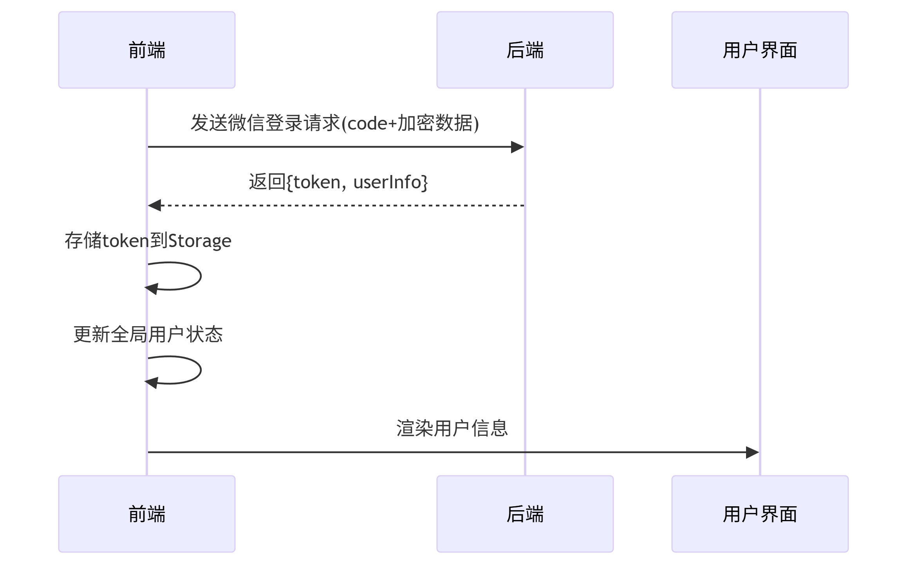

# 后端api接口文档

```aiignore
/app/text （测试接口）
/public/+图片名称 （静态目录图片接口，用于读取图片）
/uploads/+图片名称 （前台上传图片的接口，用于读取图片）
```

# 微信登录的流程图

```aiignore
## 微信登录的后端api接口，前端调用后，会把获取到的微信信息传给后端，后端存进数据库，密码不会明文存储，然后再把数据库的信息传给前端
/app/wechat-login
```

# 邮箱登录或注册接口
```aiignore
/app/getCode （获取登录验证码）
/app/succeed （获取注册验证码）
/app/addUser （向数据库写入注册信息）
```